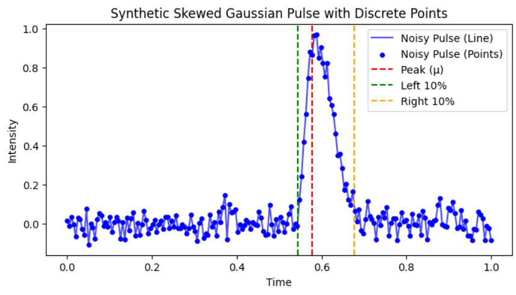

# Pulse Detection: Deep Learning vs Traditional Methods

### TL;DR:
- Built a hybrid CNN-LSTM model to detect peak position and 10% thresholds in noisy skewed Gaussian pulses
- Compared against traditional Gaussian Process Regression (GPR)
- Deep learning model seems to be faster (3ms vs 500ms), but accuracy is up for debate.

### The Problem
We have been given, `2D data` one axis is `time (x)`, and the other is `intensity (y)`.  
We are tasked with detecting a pulse (a peak) in the data. The pulse `may or may not be a gaussian`.  
The model must predict 3 parameters, the `peak` ($` \mu `$), the `right 10% (of peak)` and `left 10% (of peak)`.  
The time between the right 10% and peak is called the `rise time`.

Performance requirements:
- Must be reasonably `faster than Gaussian Regression`.
- Must be `reasonably accurate`.

Input data looks like: (synthetic)

### Data Generation
- Created synthetic dataset of skewed Gaussian pulses
- Added random noise to make it realistic
- Generated 50k training samples and 5k test samples
- Saved in HDF5 format for efficiency

### Deep Learning Approach
Built a hybrid model combining:
- 1D CNN for feature extraction
- LSTM for temporal dependencies
- Final FC layer for regression output

Performance on RTX 3050 laptop:
- Training time: `~24 mins`
- Inference: `3.08ms ± 169μs per pulse`
- CPU inference: `3.6ms ± 82.6μs (surprisingly close!)`

### Traditional Method (GPR)
Implemented Gaussian Process Regression as baseline:
- Uses RBF kernel + white noise
- Much more computationally intensive
- Fit time: `487ms ± 98ms per pulse`
- Prediction time: `34.9ms ± 827μs per pulse`

### Concluding Opinion:
For this specific task, the deep learning seems to be better than traditional methods in speed atleast. The CNN-LSTM is ~160x faster than GPR while giving better results.

